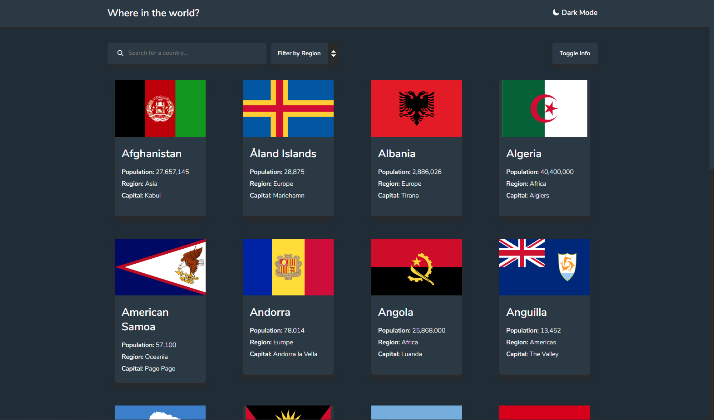

# Frontend Mentor - REST Countries API with color theme switcher solution

This is a solution to the [REST Countries API with color theme switcher challenge on Frontend Mentor](https://www.frontendmentor.io/challenges/rest-countries-api-with-color-theme-switcher-5cacc469fec04111f7b848ca).

## Overview

### The challenge

Users should be able to:

- See all countries from the API on the homepage
- Search for a country using an `input` field
- Filter countries by region
- Click on a country to see more detailed information on a separate page
- Click through to the border countries on the detail page
- Toggle the color scheme between light and dark mode

### Screenshot

### Links

- [Live Site](https://bernizhel.github.io/rest-countries-api)

## My process

### Built with

- React, Redux
- Typescript
- Styled Components
- And react-router

### What I learned

- How to work with REST API
- React and Redux toolkit
- Client-side routing with react-router

### Continued development

1. Made a page to load on scroll
2. Made a button to show stats (matched and showed countries)

## Author

- Frontend Mentor - [@bernizhel](https://www.frontendmentor.io/profile/bernizhel)
